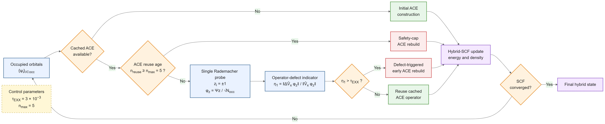

## [中文版本](https://www.misaraty.com/2026-08-27_adaptiveexx/)

## AdaptiveEXX

AdaptiveEXX is a DFTK.jl implementation of single-probe operator-defect control for bounded reuse of the adaptively compressed exchange operator in Gamma-point plane-wave hybrid DFT.

The code evaluates a stochastic operator-defect indicator using one Rademacher state in the occupied subspace and uses this indicator to decide whether a cached ACE operator can be reused or should be reconstructed before a deterministic five-call safety horizon is reached. The current implementation uses DFTK 0.7.26 and includes the PBE0 production benchmarks, stochastic-defect calibration and sensitivity calculations, fixed-period ACE comparisons, HSE06 compatibility tests, and the data required to reproduce the manuscript and Supporting Information figures and tables. `AdaptiveEXX.jl` performs the electronic-structure calculations and writes the raw data to `data/main` and `data/si`, while `plot_v4.py` generates the publication figures and tables in `figures` and `tables`.

<div align="center">
  <br>
  Single-probe defect monitoring for adaptive ACE reuse and reconstruction
</div>

## Usage

Julia 1.10 or newer is required. The Julia script automatically activates the local `.julia_env` environment and installs or repairs the required DFTK 0.7.26 and PseudoPotentialData dependencies when needed. Python with NumPy and Matplotlib is required for plotting. Run the calculations and then generate the figures and tables from the project directory:

```bash
julia AdaptiveEXX.jl
python plot_v4.py
```

If the raw data are already present and only the manuscript figures and tables need to be regenerated, run:

```bash
python plot_v4.py
```

## Citation

To be added after the paper is officially published.