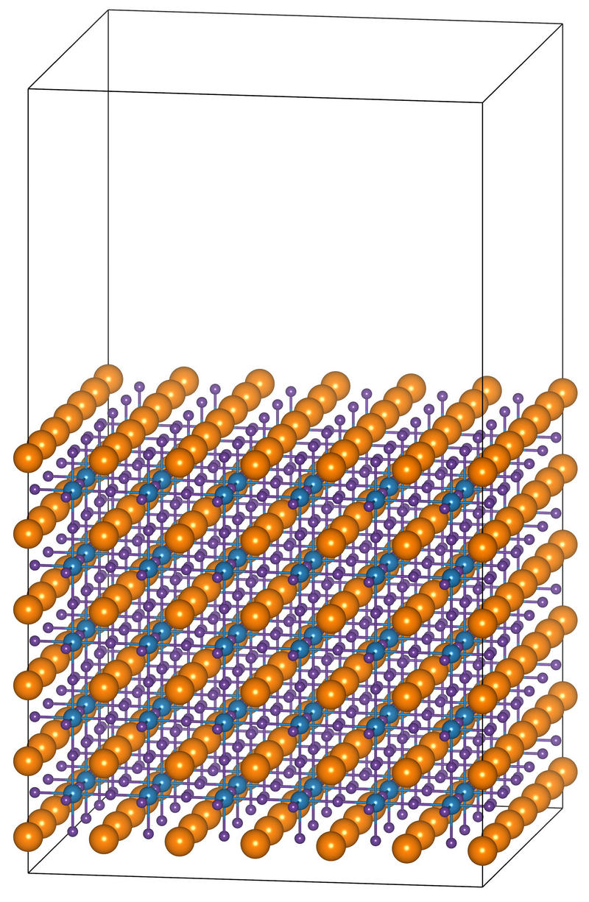

## **[中文版本](https://www.misaraty.com/2025-07-22_add-selective-dynamics/)**

---

## Structure Example

* **POSCAR**

We use CsPbCl₃ as an example. You can visualize the structure in VESTA and select atoms with fractional z between `0.0` and `0.16` to be fixed.

<div align="center">
  
</div>

The corresponding POSCAR (before tagging):

```shell
CsPbCl3
1.0
       33.6300010681         0.0000000000         0.0000000000
        0.0000000000        33.6300010681         0.0000000000
        0.0000000000         0.0000000000        58.0250015259
   Cl   Cs   Pb
  576  216  180
Direct
     0.000000000         0.083329998         0.094520003
     0.000000000         0.083329998         0.191110000
     0.000000000         0.083329998         0.287710011
     0.000000000         0.083329998         0.384310007
     0.000000000         0.083329998         0.480899990
     0.083329998         0.000000000         0.094520003
     ...
```
Running the Script
Script: add_selective_dynamics_v1.1.py

This script adds Selective Dynamics to the POSCAR file and marks atoms with F F F if their fractional z lies within a given range.

```python
# ======== Parameter Settings ========
zmin = 0.0  # Minimum fractional z to fix
zmax = 0.16  # Maximum fractional z to fix
input_path = "POSCAR"
output_path = "POSCAR_sd"
```

> [!NOTE]
> Before running, modify zmin and zmax according to your structure.

Output POSCAR
After running the script, atoms within the z-range will be tagged as fixed:

```shell
CsPbCl3
1.0
       33.6300010681         0.0000000000         0.0000000000
        0.0000000000        33.6300010681         0.0000000000
        0.0000000000         0.0000000000        58.0250015259
   Cl   Cs   Pb
  576  216  180
Selective Dynamics
Direct
0.000000000  0.083329998  0.094520003  F F F
0.000000000  0.083329998  0.191110000  T T T
0.000000000  0.083329998  0.287710011  T T T
0.000000000  0.083329998  0.384310007  T T T
0.000000000  0.083329998  0.480899990  T T T
0.083329998  0.000000000  0.094520003  F F F
...
```
