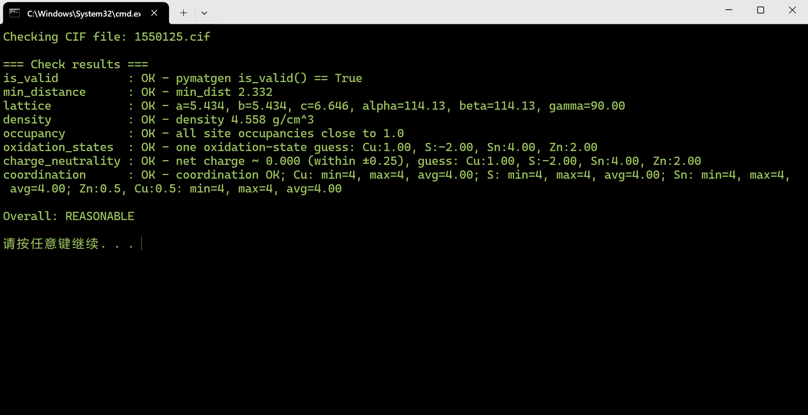

## **[中文版本](http://localhost:1313/2025-11-30_cif%E7%BB%93%E6%9E%84%E5%90%88%E7%90%86%E6%80%A7%E6%A3%80%E6%9F%A5/)**

## CIF Structural Reasonableness Checker

[CIF Structural Reasonableness Checker.py](./CIF%20Structural%20Reasonableness%20Checker.py) evaluates the physical, geometrical, and chemical reasonableness of a CIF structure using multiple pymatgen-based validation criteria.

## Design Philosophy
The script provides a fast multi-criterion sanity check for crystallographic structures (CIF files) before downstream simulations such as DFT, machine-learning-based prediction, or dataset construction. It uses a modular validation strategy:

1. Geometry Validation  
   - minimum interatomic distance  
   - lattice constants and lattice angles  
   - atomic coordination environment  

2. Physical Property Validation  
   - density consistency  
   - site occupancy completeness  

3. Chemical Validity Validation  
   - oxidation-state estimation  
   - global charge neutrality evaluation  

4. Composite Evaluation  
   - each test reports OK or FAIL with diagnostic messages  
   - a final summary classifies the structure as REASONABLE or HAS ISSUES

This design ensures transparency, reproducibility, and suitability for high-throughput workflows and automated preprocessing of large structural datasets.

## Parameter Overview

### Geometry-related Parameters
- MIN_DIST_THRESH: minimum allowed interatomic distance (default: 0.8 Å)
- L_MIN, L_MAX: allowed range of lattice lengths (default: 1.0–30.0 Å)
- ANGLE_MIN, ANGLE_MAX: allowed range of lattice angles (default: 20°–160°)
- COORD_CUTOFF: cutoff radius for computing coordination numbers (default: 3.0 Å)
- MAX_CN: upper limit for acceptable coordination number (default: 12)

### Physical-property-related Parameters
- DENSITY_MIN, DENSITY_MAX: valid density range in g/cm^3 (default: 1.0–15.0)
- OCC_TOL: tolerance for site occupancy to deviate from 1.0 (default: 0.05)

### Chemical-reasonableness Parameters
- CHARGE_TOL: allowed deviation from global charge neutrality (default: ±0.25)

## Summary
This script functions as a comprehensive CIF reasonableness validator, checking structural, physical, and chemical consistency using a clear set of thresholds. The modular design makes it well-suited for high-throughput screening, structure filtering, and automated quality control of generated or experimental CIF files.

  

