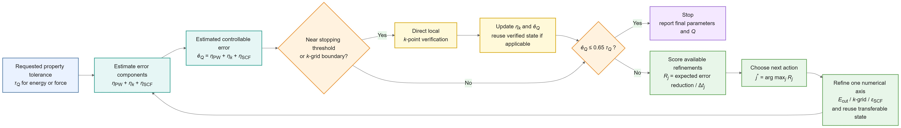

## [中文版本](https://www.misaraty.com/2026-08-28_goaldft/)

## GoalDFT

GoalDFT is a DFTK.jl implementation of property-oriented joint numerical error control for plane-wave density functional theory calculations.

The code starts from a requested energy or force tolerance and jointly monitors the controllable numerical contributions from the plane-wave cutoff, k-point sampling, and self-consistent-field convergence. It selects the next refinement using an error-to-cost score, reuses compatible electronic states, and applies direct local k-point verification near sensitive stopping decisions. The current implementation uses DFTK 0.7.26 with the PBE functional and PseudoDojo norm-conserving pseudopotentials, and includes energy and force benchmarks, uniform-refinement comparisons, estimator-calibration trajectories, reference/high-precision validation calculations, and the data required to reproduce the manuscript and Supporting Information figures and tables. `GoalDFT.jl` performs the electronic-structure calculations and writes the raw data to `data/main` and `data/si`, while `plot_v3.py` generates the publication figures and tables in `figures` and `tables`.

<div align="center">
  <br>
  GoalDFT numerical error control loop
</div>

## Usage

Julia 1.10 or newer is required. The Julia script automatically activates the local `.julia_env` environment and installs or repairs the required DFTK 0.7.26 and PseudoPotentialData dependencies when needed. Python with NumPy and Matplotlib is required for plotting. Run the calculations and then generate the figures and tables from the project directory:

```bash
julia GoalDFT.jl
python plot_v3.py
```

If the raw data are already present and only the manuscript figures and tables need to be regenerated, run:

```bash
python plot_v3.py
```

## Citation

To be added after the paper is officially published.
