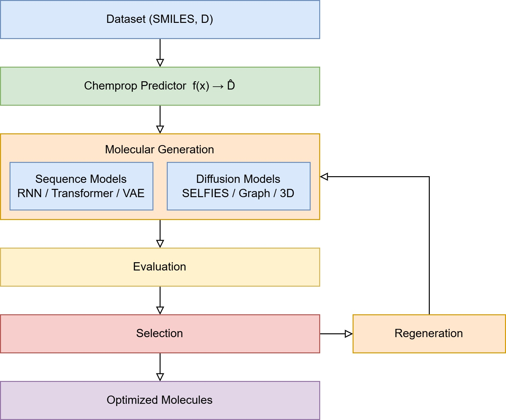

## **[中文版本](https://www.misaraty.com/2026-02-20_imod/)**

## Inverse Molecular Design (IMoD)

   
  Workflow of the molecular generation and evaluation framework

## Usage

* The `./example` directory contains three complete example datasets used in the paper: `energetics`, `BACE`, and `permeability`.

* To migrate to a custom dataset, place `Sequence_v1.2.py`, `Diffusion_v1.2.py`, and `D.csv` in the same directory. The filename can be changed by modifying `DATA_CSV = "D.csv"`. `D.csv` must contain two columns: `SMILES`: molecular representation, `D`: target property. The label column matching rule can be modified via ``r"(^|[^A-Za-z])D([^A-Za-z]|$)|label|target"``.

* The execution commands are `python Sequence_v1.2.py` and `python Diffusion_v1.2.py`, respectively.

* `TARGET_D` in `equence_v1.2.py` and `Diffusion_v1.2.pyS` represents the target property value expected for the generated molecules. In `Diffusion_v1.2.py`, `GRAPH_N_MAX` and `GEODIFF_N_MAX` should be set to the maximum number of atoms (including the hydrogenated structure), while `GRAPH_ATOMS` specifies the types of elements considered.

* The file `smiles_check_v6.py` in the `./smiles_check` directory is an automated post processing script used to screen and visualize generated molecular results. It reads SMILES and predicted performance metric D from `generated_with_pred_MERGED_R5.csv`, filters and ranks molecules with D>9.4 (`df = df[df[D_COL] > 9.4]`), and performs comprehensive chemical validity screening using RDKit. In addition, it includes an optional novelty filter that removes molecules already present in `Dm.csv` based on canonical SMILES matching, as well as an optional maximum-ring-size filter (default threshold = 12) controlled by a front-end switch. The checks include successful SMILES parsing and `SanitizeMol`, single neutral component without salts and optional radical restriction, optional atom whitelist, molecular size limits for atom and heavy-atom counts, physicochemical ranges including MW, LogP, TPSA, HBD/HBA and rotatable bonds, ring and aromatic ring limits, PAINS structural alerts, and synthetic accessibility SA score thresholding.

> [!NOTE]
> `chemprop` uses `v1.6.1`; the calling method differs between `Windows` and `Ubuntu`, and both `Sequence_v1.2.py` and `Diffusion_v1.2.py` support the two platforms.
>
> To avoid an oversized repository, the `./example` directory does not include `*.pt` files. If needed, the corresponding `*.pt` files can be obtained via email (misaraty@163.com) or regenerated by running the scripts.

## Citation

To be added after the paper is officially published.