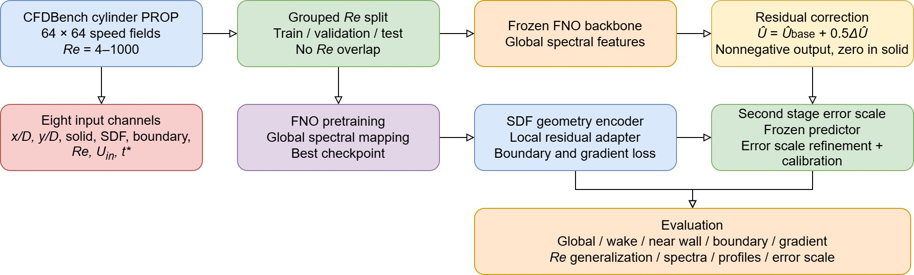

## [中文版本](https://www.misaraty.com/2026-08-09_pcfno/)

# PCFNO

PCFNO is a physically constrained Fourier neural operator for nonautoregressive prediction of normalized speed magnitude in cylinder wakes across Reynolds numbers. The model combines a frozen FNO backbone with a lightweight residual correction using geometry and boundary information.

<div align="center">
  <br>
  Computational workflow of PCFNO
</div>

## Usage

Create a `cylinder` folder in the project directory.

Download `bc.zip`, `geo.zip`, and `prop.zip` from the [CFDBench cylinder dataset](https://huggingface.co/datasets/chen-yingfa/CFDBench/tree/main/cylinder):

Place the three ZIP files in `./cylinder/`. The script automatically extracts them when needed.

Run:

```bash
python PCFNO.py
```

The reported experiments use the cylinder PROP subset.

## Citation

To be added after the paper is officially published.
