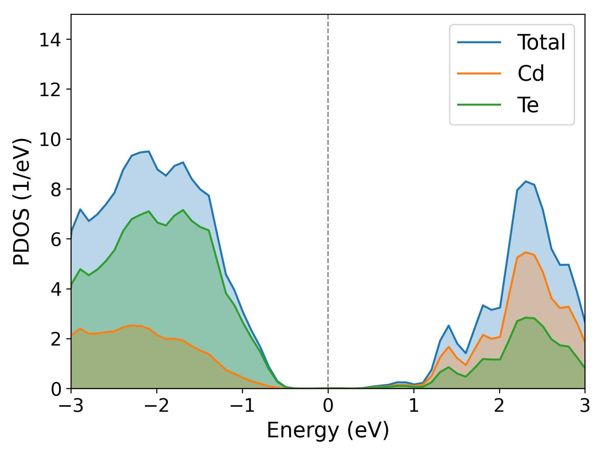

## **[中文版本](https://www.misaraty.com/2024-09-26_qetool/)**

## **Updates**

* The latest version is `QEtool_v1.3.py`

* Test examples are located in the `example` folder.

## **Preparation**

### QE Path

* Modify the path in `QEtool.py`,

```Python
qe_bin = '/opt/ohpc/pub/apps/qe-7.3/bin'
```

### Pseudopotential Path

* Install [SSSP pseudopotentials](https://www.materialscloud.org/discover/sssp/table/efficiency) and [PSLibrary pseudopotentials](https://dalcorso.github.io/pslibrary/) on the cluster.

* Modify the path in `QEtool.py`,

```Python
if upf_type == 'sssp_precision':
    upf_files = {line.split()[0]: line.split()[1] for line in upf_files_sssp_precision.strip().split('\n')}
    pseudo_dir = '/opt/ohpc/pub/apps/sssp/precision/'
elif upf_type == 'sssp_efficiency':
    upf_files = {line.split()[0]: line.split()[1] for line in upf_files_sssp_efficiency.strip().split('\n')}
    pseudo_dir = '/opt/ohpc/pub/apps/sssp/efficiency/'
elif upf_type == 'pslibrary':
    upf_files = {line.split()[0]: line.split()[1] for line in upf_files_pslibrary.strip().split('\n')}
    pseudo_dir = '/opt/ohpc/pub/apps/pslibrary.1.0.0/pbe/PSEUDOPOTENTIALS/'
```

### Provide POSCAR

* The example uses the file `cdte.vasp`.

## **relax**

* Modify the calculation type in `QEtool.py`,

```Python
calculation_type = 'relax' # 'relax' | 'vc-relax' | 'scf' | 'nscf' | 'dos_plot'
```

* Run `QEtool.py` to generate the `relax.in` file.

```Shell
python QEtool.py
```

* Modify the cluster submission script `job.sh`,

```Shell
#!/bin/bash
#SBATCH --job-name=qe_test
#SBATCH --partition=cpu3_q
#SBATCH --output=%j.out
#SBATCH --error=%j.err
#SBATCH --nodes=1
#SBATCH --ntasks-per-node=32
							  
qe='mpirun /opt/ohpc/pub/apps/qe-7.3/bin/pw.x'

$qe <relax.in> relax.out
# $qe <vc-relax.in> vc-relax.out
# $qe <scf.in> scf.out
# $qe <nscf.in> nscf.out
```

* Submit the cluster job to generate the `relax.out` file and the `./out` folder.

```Shell
sbatch job.sh # or qsub job.sh
```

* Check `relax.out` to determine the optimized atomic coordinates.

```Shell
ATOMIC_POSITIONS (crystal)
Cd               0.0000000000        0.0000000000        0.0000000000
Cd               0.0000000000        0.5000000000        0.5000000000
Cd               0.5000000000        0.0000000000        0.5000000000
Cd               0.5000000000        0.5000000000        0.0000000000
Te               0.2500000000        0.2500000000        0.2500000000
Te               0.7500000000        0.7500000000        0.2500000000
Te               0.7500000000        0.2500000000        0.7500000000
Te               0.2500000000        0.7500000000        0.7500000000
End final coordinates
```

## **vc-relax**

* Modify the calculation type in `QEtool.py`,

```Python
calculation_type = 'vc-relax' # 'relax' | 'vc-relax' | 'scf' | 'nscf' | 'dos_plot'
```

* Run `QEtool.py` to generate the `vc-relax.in` file.

```Shell
python QEtool.py
```

* Modify the cluster submission script `job.sh`,

```Shell
#!/bin/bash
#SBATCH --job-name=qe_test
#SBATCH --partition=cpu3_q
#SBATCH --output=%j.out
#SBATCH --error=%j.err
#SBATCH --nodes=1
#SBATCH --ntasks-per-node=32
							  
qe='mpirun /opt/ohpc/pub/apps/qe-7.3/bin/pw.x'

# $qe <relax.in> relax.out
$qe <vc-relax.in> vc-relax.out
# $qe <scf.in> scf.out
# $qe <nscf.in> nscf.out
```

* Submit the cluster job to generate the `vc-relax.out` file and the `./out` folder.

```Shell
sbatch job.sh # or qsub job.sh
```

* Check `vc-relax.out` to confirm the optimized cell size and atomic coordinates.

```Shell
Begin final coordinates
     new unit-cell volume =   1882.60412 a.u.^3 (   278.97315 Ang^3 )
     density =      5.71449 g/cm^3

CELL_PARAMETERS (angstrom)
   6.534125441   0.000000000   0.000000000
   0.000000000   6.534125441   0.000000000
   0.000000000   0.000000000   6.534125441

ATOMIC_POSITIONS (crystal)
Cd               0.0000000000        0.0000000000        0.0000000000
Cd               0.0000000000        0.5000000000        0.5000000000
Cd               0.5000000000        0.0000000000        0.5000000000
Cd               0.5000000000        0.5000000000        0.0000000000
Te               0.2499998757        0.2499998757        0.2499998757
Te               0.7500001243        0.7500001243        0.2499998757
Te               0.7500001243        0.2499998757        0.7500001243
Te               0.2499998757        0.7500001243        0.7500001243
End final coordinates
```

## **scf**

* Modify the calculation type in `QEtool.py`,

```Python
calculation_type = 'scf' # 'relax' | 'vc-relax' | 'scf' | 'nscf' | 'dos_plot'
```

* Run `QEtool.py` to generate the `scf.in` file.

```Shell
python QEtool.py
```

> [!NOTE]
> * `QEtool.py` will automatically replace the optimized cell size and atomic coordinates based on `vc-relax.out`;
> 
> * If `vc-relax.out` is absent but `relax.out` is present, it will replace the optimized atomic coordinates;
> 
> * If both are absent, it will use the cell size and atomic coordinates from `cdte.vasp`.

* Modify the cluster submission script `job.sh`,

```Shell
#!/bin/bash
#SBATCH --job-name=qe_test
#SBATCH --partition=cpu3_q
#SBATCH --output=%j.out
#SBATCH --error=%j.err
#SBATCH --nodes=1
#SBATCH --ntasks-per-node=32
							  
qe='mpirun /opt/ohpc/pub/apps/qe-7.3/bin/pw.x'

# $qe <relax.in> relax.out
# $qe <vc-relax.in> vc-relax.out
$qe <scf.in> scf.out
# $qe <nscf.in> nscf.out
```

* Submit the cluster job to generate the `scf.out` file and the `./out` folder.

```Shell
sbatch job.sh # or qsub job.sh
```

## **dos**

* Modify the calculation type in `QEtool.py`,

```Python
calculation_type = 'nscf' # 'relax' | 'vc-relax' | 'scf' | 'nscf' | 'dos_plot'
```

* Run `QEtool.py` to generate the `nscf.in` file.

```Shell
python QEtool.py
```

> [!NOTE]
> * `QEtool.py` will automatically replace the optimized cell size and atomic coordinates based on `vc-relax.out`;
> 
> * If `vc-relax.out` is absent but `relax.out` is present, it will replace the optimized atomic coordinates;
> 
> * If both are absent, it will use the cell size and atomic coordinates from `cdte.vasp`.

* Modify the cluster submission script `job.sh`,

```Shell
#!/bin/bash
#SBATCH --job-name=qe_test
#SBATCH --partition=cpu3_q
#SBATCH --output=%j.out
#SBATCH --error=%j.err
#SBATCH --nodes=1
#SBATCH --ntasks-per-node=32
							  
qe='mpirun /opt/ohpc/pub/apps/qe-7.3/bin/pw.x'

# $qe <relax.in> relax.out
# $qe <vc-relax.in> vc-relax.out
# $qe <scf.in> scf.out
$qe <nscf.in> nscf.out
```

* Submit the cluster job to generate the `nscf.out` file and the `./out` folder.

```Shell
sbatch job.sh # or qsub job.sh
```

## **dos_plot**

* Modify the calculation type in `QEtool.py`,

```Python
calculation_type = 'dos_plot' # 'relax' | 'vc-relax' | 'scf' | 'nscf' | 'dos_plot'
```

* Run `QEtool.py`, which first generates `pdos.in`, then calls the `projwfc.x` command to create `qe.pdos_tot` and a series of files like `qe.pdos_atm#1(Cd)_wfc#1(s)`. Next, it calls `sumpdos.x` to automatically generate `Cd.dat` and `Te.dat` based on the element types, reads the Fermi energy from `nscf.out`, and ultimately produces `dos.jpg`.

```Shell
python QEtool.py
```

<div align="center">
  
</div>
