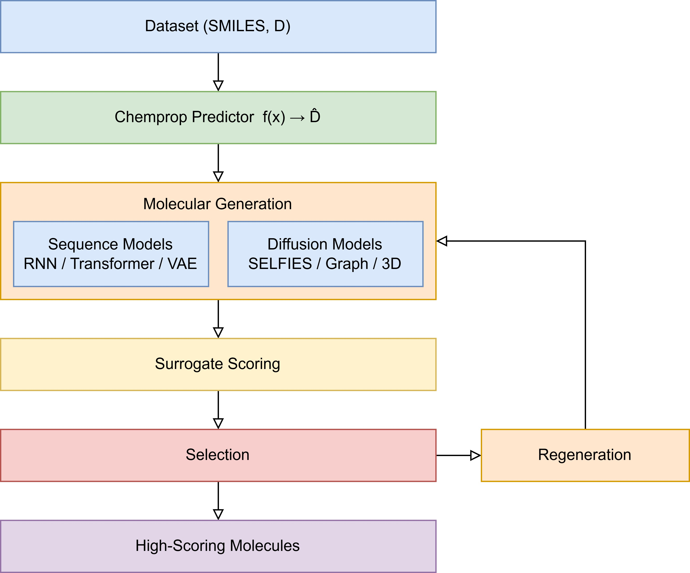

## **[中文版本](https://www.misaraty.com/2026-02-20_sgmd/)**

## Surrogate-Guided Molecular Discovery (SGMD)

SGMD is a surrogate-guided molecular generation and iterative enrichment framework. It trains a Chemprop property predictor, generates molecules in several complementary molecular representations, predicts their target property, and feeds the best candidates into the next generation round.

<div align="center">
  <br>
  Workflow of the surrogate-guided molecular generation and discovery framework
</div>

### v1.4

- Added invalid-SMILES reporting and canonicalization of `D.csv`.

- Added configurable duplicate-label aggregation.

- Added internal generated-pool deduplication and novelty filtering against `D.csv`.

- Added neutral-charge, excluded-element, and dataset-derived heavy-atom filters.

- Added maximization/minimization support through `TARGET_DIRECTION`.

- Added explicit fixed five-fold train/validation/test handling, metrics, plot, and plot data.

- Added automatic discovery of molecular elements and graph/GeoDiff capacity from the input data.

- Changed the default custom-data filename to `D.csv`.

### v1.2

- Paper/example release.

- Sequence ensemble: RNN, Transformer, and VAE.

- Diffusion ensemble: SELFIES, graph, and geometry-aware diffusion.

- Chemprop-guided iterative generation and threshold-based hit selection.

- Bundled BACE, energetics, and permeability examples with output artifacts.

### Which version should I use?

| Version | Best use | Main behavior |
| --- | --- | --- |
| v1.5 | New custom datasets; recommended default | Retains v1.4 safeguards and automatically derives sequence/node limits, GPU-aware batch sizes, minimum valid count, and enrichment seed count. It also records the resolved configuration and uses the merged candidate pool for iterative feedback. |
| v1.4 | Custom datasets requiring explicit control | Adds robust input cleaning, duplicate handling, novelty filtering, fixed five-fold evaluation, min/max target support, and dataset-derived chemical-space limits. Target direction and several generation settings remain manually configurable. |
| v1.2 | Reproducing the paper and the bundled examples | Uses fixed/manual generation settings and `D.csv`; the bundled examples correspond to this version. |

## Generative branches

`Sequence_*.py` trains three sequence models:

- GRU-based molecular RNN

- molecular Transformer

- molecular VAE

`Diffusion_*.py` trains three diffusion branches:

- SELFIES diffusion

- graph diffusion

- geometry-aware diffusion (GeoDiff)

Both pipelines use a Chemprop ensemble as the surrogate property predictor and perform rounds `R0` through `R5` by default.

## Input data

Use a CSV file with at least two columns:

```csv
SMILES,D
CCO,1.23
CCN,2.34
```

- The molecular column name must contain `smiles` (case-insensitive).

- The target column should be named `D`, `target`, or `label`; `velocity` is also recognized.

- The target values must be numeric.

- v1.2, v1.4 and v1.5 use `D.csv` by default.

## Using v1.5

Create a clean task directory. Copy one v1.5 script and your dataset into it:

```text
my_task/
├── D.csv
└── Sequence_v1.5.py
```

or:

```text
my_task/
├── D.csv
└── Diffusion_v1.5.py
```

Edit the configuration block near the top of the selected script. At minimum, check:

```python
DATA_CSV = "D.csv"
TARGET_D = 20
DM_DUPLICATE_MODE = "mean"
EXCLUDED_ELEMENTS = []
SIZE_FILTER_QUANTILES = (0.01, 0.99)
NUM_GEN = 2048          # Sequence_v1.5.py
NUM_GEN = 1024          # Diffusion_v1.5.py
ENRICH_ROUNDS = 5
```

Run exactly one pipeline in the task directory:

```bash
python Sequence_v1.5.py
```

or:

```bash
python Diffusion_v1.5.py
```

Do not run the Sequence and Diffusion scripts simultaneously in the same task directory: both write to `runs/mol_chemprop_multi/` and may overwrite or mix outputs. Use separate directories when comparing them.

### Target direction

The direction is inferred from the training-set median:

- if `TARGET_D >= median(D)`, SGMD maximizes the property and retains hits with `D_pred >= TARGET_D`;

- if `TARGET_D < median(D)`, SGMD minimizes the property and retains hits with `D_pred <= TARGET_D`.

If this rule does not represent the scientific objective and the direction must be forced independently of the threshold, use v1.4 and set `TARGET_DIRECTION = "max"` or `"min"`.

### Automatically derived settings

| Pipeline | v1.5 automatic settings |
| --- | --- |
| Sequence | `MAX_LEN` from the maximum valid SELFIES length, aligned to a multiple of 8; `BATCH_SIZE_GEN` and `SAMPLE_BATCH_SIZE` from GPU memory and sequence length; enrichment seed count from 10% of candidates, bounded to 32–256. |
| Diffusion | SELFIES length and prefix limit from the dataset; graph/GeoDiff elements and node capacity from the dataset; batch size from GPU memory and molecular size; `MIN_VALID` from 12.5% of `NUM_GEN`; enrichment seed count from 10% of candidates, bounded to 32–256. |

The resolved values are saved as:

- `runs/mol_chemprop_multi/outputs/auto_config_sequence.txt`

- `runs/mol_chemprop_multi/outputs/auto_config_diffusion.txt`

Only the file for the pipeline that was run will be created.

## Using v1.4

The preparation and command are the same as v1.5, except that the input script is `Sequence_v1.4.py` or `Diffusion_v1.4.py`.

Important common settings are:

```python
DATA_CSV = "D.csv"
TARGET_D = 20
TARGET_DIRECTION = "auto"   # auto, max, or min
DM_DUPLICATE_MODE = "mean"  # first, mean, median, max, or min
EXCLUDED_ELEMENTS = []
SIZE_FILTER_QUANTILES = (0.01, 0.99)
ENRICH_ROUNDS = 5
TOPK_SEED = 256
```

Use v1.4 when you need to force the optimization direction or retain manual control of values such as sequence length, batch size, valid-generation target, and top-seed count.

Run:

```bash
python Sequence_v1.4.py
```

or:

```bash
python Diffusion_v1.4.py
```

## Using v1.2

The three bundled datasets contain separate `Sequence/` and `Diffusion/` directories. For example:

```bash
cd example/BACE/Sequence
python Sequence_v1.2.py
```

```bash
cd example/BACE/Diffusion
python Diffusion_v1.2.py
```

## Main output files

All output is written below:

```text
runs/mol_chemprop_multi/
├── models_chemprop/
│   ├── fold_0/ ... fold_4/
│   └── cv_splits/
└── outputs/
```

| Output | Meaning |
| --- | --- |
| `invalid_smiles_in_D.csv` | Invalid input SMILES, created only when invalid rows exist. |
| `Dm_deduplicated.csv` | Canonicalized and label-aggregated training data from Sequence v1.4/v1.5. |
| `kfold_*pred*.jpg` | Fixed five-fold observed-versus-predicted plot. |
| `kfold_*pred*.dat` | Plot source data for the five-fold evaluation. |
| `verbose.log` | Per-fold MAE, RMSE, R², and aggregate statistics. |
| `generated_*_R0.csv` ... `generated_*_R5.csv` | Molecules generated by an individual branch in each round. |
| `generated_merged_round0.csv` ... `generated_merged_round5.csv` | Deduplicated merged candidate pools. |
| `generated_with_pred_*_R*.csv` | Generated molecules plus Chemprop prediction, sorted in the optimization direction. |
| `generated_hits_*_R*.csv` | Candidates satisfying the `TARGET_D` threshold. |

The usual final files are:

```text
runs/mol_chemprop_multi/outputs/generated_with_pred_MERGED_R5.csv
runs/mol_chemprop_multi/outputs/generated_hits_MERGED_R5.csv
```

Use `generated_with_pred_MERGED_R5.csv` when all final candidates and their predictions are needed. Use `generated_hits_MERGED_R5.csv` when only threshold-qualified candidates are needed.

### Post-processing generated molecules

`smiles_check/smiles_check_v6.py` provides optional RDKit-based screening and visualization. It can perform validity and sanitization checks, neutral/single-component filtering, atom and size restrictions, physicochemical range filtering, ring limits, PAINS alerts, synthetic accessibility scoring, and optional novelty filtering against a reference CSV.

Before running it, edit its input path, predicted-property column/threshold, optional reference dataset, and screening switches to match the current task. The bundled `sascorer.py` and `fpscores.pkl.gz` must remain accessible to the post-processing script.

## Notes

- The example archive omits some `*.pt` model files to keep its size manageable. Regenerate them by rerunning the relevant script if needed.

- A full run retrains five Chemprop folds and all three generators. Existing directories may be deleted or overwritten by parts of the scripts, so archive important results or use a fresh task directory.

- Exact numerical reproduction also depends on the software environment, CUDA/PyTorch behavior, and available checkpoint files.

## Citation

- [Zhang, Z.*; Liu, Y.; Liu, J.; Zhang, W.; Xiong, Q. A UniZhang, Z.*; Liu, Y.; Liu, J.; Zhang, W.; Xiong, Q. A Unified Deep Generative Framework for Surrogate-Guided Molecular Discovery across Diverse Molecular Spaces. Phys. Chem. Chem. Phys. 2026, 28, 19038-19045](https://pubs.rsc.org/CP/article-lookup/doi/10.1039/D6CP01102K)

