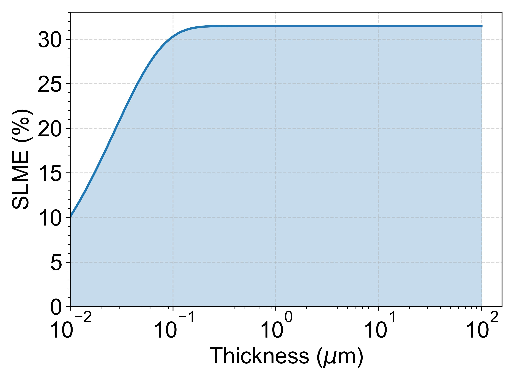

## **[中文版本](https://www.misaraty.com/2026-03-13_%E5%85%89%E8%B0%B1%E6%9E%81%E9%99%90%E6%9C%80%E5%A4%A7%E6%95%88%E7%8E%87slme/)**

## I. Program Overview

`SLME_v2.py` is a `Python` script for calculating the `Spectroscopic Limited Maximum Efficiency` (`SLME`). `SLME` is an improved metric over the traditional `Shockley–Queisser` limit efficiency. By introducing the actual absorption coefficient spectrum of a material, it enables a more realistic evaluation of the theoretical efficiency of semiconductor materials in solar cells.

The script takes the material’s `absorption coefficient data (ABSORPTION.dat)` as input and combines it with the [AM1.5G solar spectrum (am1.5G.dat)](https://www.nlr.gov/grid/solar-resource/spectra-am1.5) to calculate the `SLME` at different material thicknesses. The program first reads the material absorption spectrum and interpolates it to the wavelength range of the solar spectrum. Then, based on the `Beer–Lambert` law, it calculates the optical absorptance at different wavelengths. By integrating the spectra, the short-circuit current J<sub>sc</sub> and the radiative recombination current J<sub>0</sub> are obtained. Numerical optimization is then used to determine the maximum power point, from which the `SLME` is calculated.

In addition, the script scans the efficiency variation over different thin-film thicknesses (10<sup>-8</sup>–10<sup>-4</sup> m), plots the relationship between `SLME` and thickness, and finally outputs a high-resolution image `SLME_thickness.jpg`. This program is suitable for theoretical efficiency evaluation of photovoltaic materials (such as CdTe, CZTS, perovskites, etc.) whose absorption spectra are obtained from first-principles calculations.

## II. Usage Instructions

### 1. Prepare Input Files

Two input files are required:

#### (1) ABSORPTION.dat

This file contains the material absorption spectrum data, which can be obtained from VASP optical property calculations. The following parameter should be set in `INCAR`:

```shell
LOPTICS = .TRUE.
```

It is generally recommended to use more accurate electronic structure methods such as HSE06 to obtain more reliable optical absorption spectra.

After the VASP calculation is completed, the optical calculation results can be post-processed using `VASPKIT` to extract the absorption coefficient data and generate the `ABSORPTION.dat` file.

Example file format:

```shell
 #energy          xx(cm^-1)       yy(cm^-1)       zz(cm^-1)       xy(cm^-1)       yz(cm^-1)       zx(cm^-1)
  0.00000000E+00  0.00000000E+00  0.00000000E+00  0.00000000E+00  0.00000000E+00  0.00000000E+00  0.00000000E+00
  0.45000000E-02  0.49790876E+04  0.49792610E+04  0.49797164E+04  0.15547450E+03  0.42994138E+03  0.54052647E+03
  0.89000000E-02  0.69632953E+04  0.69635378E+04  0.69641746E+04  0.21743110E+03  0.60127306E+03  0.75592631E+03
  0.13400000E-01  0.85602803E+04  0.85605820E+04  0.85613630E+04  0.26735249E+03  0.73916417E+03  0.92926781E+03
...
```

Where First column: energy (eV), Columns 2–4: absorption coefficients in the x, y, and z directions.

#### (2) am1.5G.dat

This file contains the [AM1.5G solar spectrum data](https://www.nlr.gov/grid/solar-resource/spectra-am1.5).

### 2. Run the Program

```shell
python SLME_v2.py
```

The program will perform the following steps: read `ABSORPTION.dat` and `am1.5G.dat`, calculate the material `SLME`, scan the efficiency variation over different thicknesses, print the `SLME` percentage on the screen, and generate a figure showing the efficiency as a function of thickness.

#### Example screen output

```shell
File: ABSORPTION.dat
Standard SLME: xx.xx%
```

#### Output file

The program generates `SLME_thickness.jpg`, which shows the relationship between `SLME` and material thickness.

<div align="center">
  <br>
  Spectroscopic limited maximum efficiency (SLME) as a function of absorber thickness calculated from the optical absorption spectrum under the AM1.5G solar spectrum using the Beer–Lambert absorption model.
</div>

## III. Notes

### 1. Absorption Coefficient Units

Script parameter:

```python
absorbance_in_inverse_centimeters=True
```

This indicates that the program assumes the absorption coefficients in `ABSORPTION.dat` are in units of cm^-1. The script will automatically convert them to m^-1 for the calculation.

### 2. Directional Averaging of Absorption Spectrum

`ABSORPTION.dat` usually contains absorption coefficients in three directions: `alpha_x`, `alpha_y`, and `alpha_z`. The script automatically averages the three directions:

`alpha = (alpha_x + alpha_y + alpha_z) / 3`

to obtain an isotropic average absorption coefficient for the `SLME` calculation.

### 3. Band Gap Parameter Settings

The parameters in the script:

```python
material_direct_allowed_gap
material_indirect_gap
```

represent the material's:

- Direct band gap (eV)
- Indirect band gap (eV)

If the material is a direct band-gap semiconductor, it can be set as:

`material_direct_allowed_gap = material_indirect_gap`.

### 4. Thickness Range

The program scans the material thickness range from 10<sup>-8</sup>–10<sup>-4</sup> m by default. During plotting, the thickness will be converted to `μm`, which is useful for analyzing the effect of material thickness on efficiency in thin-film solar cells.
