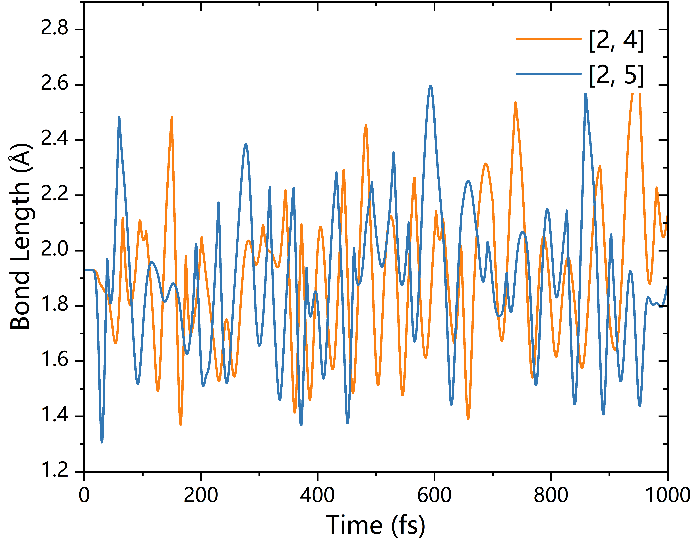
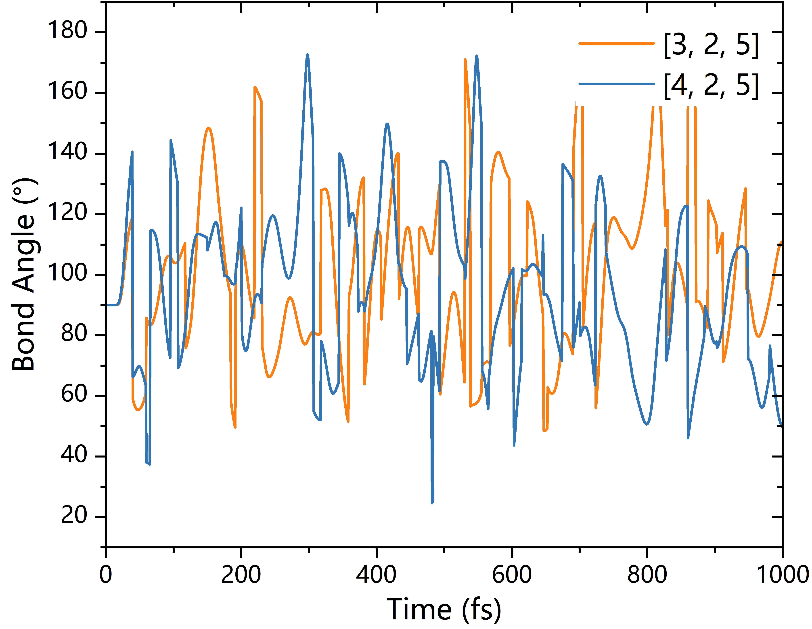

## **[中文版本](https://www.misaraty.com/2025-06-26_md%E9%94%AE%E9%95%BF%E9%94%AE%E8%A7%92%E5%88%86%E6%9E%90/)**

## **MD Simulation**

* **POSCAR**

Using [CaTiO₃ mp-5827](https://legacy.materialsproject.org/materials/mp-5827/) as an example, perform a high-precision SCF calculation to obtain a `POSCAR` file for `MD` input.

* **INCAR**

```shell
PREC = Accurate
SMASS = -3   #micro canonical ensemble
LREAL = A   #real space
IBRION = 0   #molecular dynamics
NBLOCK = 1   #update XDATCAR every x steps
TEBEG = 300   #start temperature
TEEND = 300   #final temperature
ISIF = 2   #2, ions change; 3, shape and ions change
ISYM = 0   #symmetry
NSW = 1000   #max ionic steps
POTIM = 1   #step width scaling
EDIFFG = -0.01   #ionic relaxation
EDIFF = 1e-5   #electronic SC-loop
LCHARG = .F.   #not save CHGCAR CHG
LWAVE = .F.   #not save WAVECAR
ISMEAR = 0   #gaussian smearing
SIGMA = 0.05   #the width of the smearing in eV
ALGO = Normal   #electronic minimisation algorithm
IVDW = 12   #DFT-D3 method with Becke-Jonson damping, van der Waals
```

> [!NOTE]
> If needed, use `SMASS = -1` for initial thermalization, then switch to `SMASS = -3` for temperature control.

## **Generating pfiles**

### **Method 1: Based on OUTCAR + CONTCAR**


## MD Simulation

* **POSCAR**

Use [CaTiO₃ mp-5827](https://legacy.materialsproject.org/materials/mp-5827/) as an example. First perform a high-precision SCF calculation to generate the structure input for MD.

* **INCAR**

See the file: `INCAR` for recommended settings for NVE simulations at 300 K with van der Waals correction.

> [!TIP]
> You can use `SMASS = -1` for pre-heating and then switch to `SMASS = -3` for equilibrium sampling.

## Generating `pfiles`

### Method 1: Using OUTCAR + CONTCAR

* Required files: `OUTCAR` and `CONTCAR` after MD simulation.

> [!NOTE]
> You can also use `OUTCAR + POSCAR` by slightly modifying the script.

* Use the script: `md_outcar_pfiles_v2.2.py`

This script reads coordinates from `OUTCAR` and creates individual structure files (`p0001`, `p0002`, ...) in a new folder `./pfiles`.

> [!NOTE]
> The generated `pXXXX` files are in **Cartesian coordinates**.

### Method 2: Using XDATCAR

* Required file: `XDATCAR` after MD simulation.

* Use the script: `md_xdatcar_pfiles_v1.1.py`

This script reads each MD frame and writes it to separate files in `./pfiles`.

> [!NOTE]
> The generated `pXXXX` files are in **fractional coordinates**.

## Bond Length Analysis

> [!NOTE]
> The script automatically detects and supports both Cartesian and Direct coordinates.

* Use the script: `bond_length_time_v7.2.py`  
This script calculates bond lengths between specified atom pairs over time.

> [!NOTE]
> - Set `num = 1000` for the number of MD steps.
> - Set `name = [[2, 4], [2, 5]]` to specify atom pairs (1-based indexing).
> - Works for any lattice system, including triclinic.

Output file: `bond_length_time.dat`

Example plot:

<div align="center">
  
</div>

## Bond Angle Analysis

* Use the script: `angle_time_v7.2.py`  
This script computes time-dependent angles between triplets of atoms.

- Set `num = 1000` for the number of MD steps.
- Set `name = [[3, 2, 5], [4, 2, 5]]` for analyzing angles ∠A–B–C (B is the vertex).
- Atom indices are 1-based. Multiple angle triplets are supported.
- Supports arbitrary crystal systems.

Output file: `angle_time.dat`

Example plot:

<div align="center">
  
</div>


